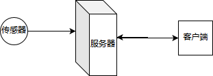

## 关于信息的多客户端实时显示实例

#### 引言

在ICT应用中，很多时候需要把传感器接收到的信息展示给另外的客户端，这就是涉及到信息的客户端实时显示问题。

通常硬件获取信息后在另外的客户端实时显示有这样的一个数据流转路径



在一般系统中服务器可以是上位机带有专门的服务程序，客户端可以是真实的单独Pc程序,也可以是浏览器或者APP。

现在实在的客户端其实更多的是浏览器或者APP了。而且一些特例可能服务器和客户端在一个实体主机上（只是应用程序不同）。如果只有一个客户端要求，则系统就退化为传统的“传感器——上位机”模型，而上面的模型则支持多客户端。在这样的多客户端应用中，如何保证传感器信息及时到达客户端，就是一个值得研究的问题了。这里传感器和服务器的连接因为主要涉及硬件编程（嵌入式）编程，所以不是本文讨论的重点，这里主要讨论服务器到客户端的链路技术实现。

#### 相关技术思路和实现

1. 在传统架构中，一般采用C/S模型，客户端连接到服务器，有稳定的链路，实现专有协议的数据通信。但因为客户端需要专门开发，特别涉及UI，还涉及到很多底层，十分不便，所以当前很多应用尽量就采用了另外的架构。
2. 比较流行的B/S模型，B是指浏览器，现在很多APP其实也是基于类似的模型，这样支持PC、移动端统一应用，只需要S端提供一致的接口就好，客户端开发更便捷啦。

#### B/S 模型下的技术难点

因为传统的B/S模型下，浏览器是无稳定连接的，所以事实上客户端不能实施和S端进行实时通讯，以往都是经过很多模拟技术来实现，比如用JS轮询，AJAX轮询等等，这些技术本质上其实都是基于HTTP的不停访问，它对B和S都带来了额外的负担（特别是要求实时性比较高时，因为轮询间隔比较小，负担更重）。

#### websocket技术的解决方案

从HTML5开始，相应技术栈提供了websocket技术支持，它可以在客户端和服务器端建立稳定的一个数据通道，持续的保持数据通信，就可以很好的解决这一问题。

下面就采用这一技术提供一个具体的简单实例进行效果演示。

使用到的技术：

1. `websocketd`其github项目页面在[https://github.com/joewalnes/websocketd](https://github.com/joewalnes/websocketd)
2. `HTML5`的`javascript`编程（包含`WebSocket`）

我在一台外部Linux主机（ip:192.168.10.13）上通过下载`websocketd`部署服务器端(假设程序在当前目录下，后面的脚本也在当前目录下)，进行下面的实例，客户端是我pc机上的3个不同的浏览器（IE11、chrome74和firefox66）加载同一个html页面。

我分成了几种情况来演示：

1. 最简单的显示服务器时间信息

   * 服务器端数据程序

   ```bash
   #!/bin/bash
   # filename: date1.sh
   # 每秒刷新输出当前系统时间
   for COUNT in $(seq 1 100); do
     echo $( date )
     sleep 1
   done
   ```

   * 客户端页面

   ```html
   <!DOCTYPE html>
   <!-- filename:test1.html -->
   <html>
     <head>
       <meta charset="utf-8">
       <title>websocketd显示服务器时间例子1</title>
       <style>
         #count {
           font: bold 50px arial;
           margin: auto;
           padding: 10px;
           text-align: center;
         }
       </style>
     </head>
     <body>
       
       <div id="count"></div>
       
       <script>
         var wsserver="192.168.10.13"; // 定义ws服务地址，你需要修改为自己服务器地址
         var wsserverport="9180";      // 定义ws服务端口号，你需要修改为自己服务器端口号
         var ws = new WebSocket('ws://'+wsserver+':'+wsserverport+'/');
         ws.onopen = function() { // 连接建立后的效果设置
           document.body.style.backgroundColor = '#cfc';
         };
         ws.onclose = function() { // 连接关闭后（包括自身断开或者服务器断开）的效果设置
           document.body.style.backgroundColor = null;
         };
         ws.onmessage = function(event) { // 获得数据的处理
           document.getElementById('count').textContent = event.data;
         };
       </script>
       
     </body>
   </html>
   ```
   
   * 执行：
   
   ​	服务器端执行`  ./websocketd --port=9180 ./date1.sh &`
   
   ​    用3个不同的浏览器打开`html`文件`test1.html`即可看见效果。
   
2. 对同步来信息的分析处理

   ​	   在1的例子中，我们没有对数据进行处理，全按文本显示，如果是同样的数据，我们其实可以对数据进行处理（自定义解析，为后面复杂数据——格式化数据，正确显示应用提供基础），这里例子里，我们对数据进行一下简单的分析。

   - 服务器端数据程序

   ```bash
   #!/bin/bash
   # filename: date2.sh
   # 每秒刷新输出当前系统时间
   for COUNT in $(seq 1 100); do
     # 这里定制格式化输出了服务器时间
     echo $( date +"%Y-%m-%d:-:%H:%M:%S")
     sleep 1
   done
   ```

   - 客户端页面

   ```html
   <!DOCTYPE html>
   <!-- filename:test2.html -->
   <html>
     <head>
       <meta charset="utf-8">
       <title>websocketd显示服务器时间例子1</title>
       <style>
         #count {
           font: bold 50px arial;
           margin: auto;
           padding: 10px;
           text-align: center;
         }
       </style>
     </head>
     <body>
       
       <div id="count"></div>
       
       <script>
         var wsserver="192.168.10.13"; // 定义ws服务地址，你需要修改为自己服务器地址
         var wsserverport="9180";      // 定义ws服务端口号，你需要修改为自己服务器端口号
         var ws = new WebSocket('ws://'+wsserver+':'+wsserverport+'/');
         ws.onopen = function() { // 连接建立后的效果设置
           document.body.style.backgroundColor = '#cfc';
         };
         ws.onclose = function() { // 连接关闭后（包括自身断开或者服务器断开）的效果设置
           document.body.style.backgroundColor = null;
         };
         ws.onmessage = function(event) { // 获得数据的处理
           var datestr=event.data;
           var tmp=datestr.split(":-:");
           var outstr="日期："+tmp[0]+" "+"时间："+tmp[1];
           document.getElementById('count').textContent = outstr;
         };
       </script>
       
     </body>
   </html>
   ```

   - 执行：

   ​	服务器端执行`  ./websocketd --port=9280 ./date1.sh &` 

   ​	用3个不同的浏览器打开`html`文件`test2.html`即可看见不同效果。

3. 模拟同步下位机传来的数据

   ​	   其实模拟下位机传来数据没有那么复杂，我们假设有一个下位机可以不定期的向一个日志系统添加一行数据，我们用一个脚本去读取那个日志系统的最后一行即可。

   * 模拟产生数据的客户端程序

     ```bash
     #!/bin/bash
     # filename: radom.sh
     # 每秒刷新输出当前系统时间
     for COUNT in $(seq 1 1000); do
       echo $RANDOM >> ./data.log 
       sleep 1
     done
     ```

   - 服务器端数据程序

   ```bash
   #!/bin/bash
   # filename: data.sh
   # 每秒刷新输出当前系统时间
   for COUNT in $(seq 1 100); do
     tail -n 1 ./data.log
     sleep 1
   done
   ```

   - 客户端页面，其实和例子1的一样，只是改了下端口号

   ```html
   <!DOCTYPE html>
   <!-- filename:test3.html -->
   <html>
     <head>
       <meta charset="utf-8">
       <title>websocketd显示服务器时间例子1</title>
       <style>
         #count {
           font: bold 50px arial;
           margin: auto;
           padding: 10px;
           text-align: center;
         }
       </style>
     </head>
     <body>
       
       <div id="count"></div>
       
       <script>
         var wsserver="192.168.10.13"; // 定义ws服务地址，你需要修改为自己服务器地址
         var wsserverport="9380";      // 定义ws服务端口号，你需要修改为自己服务器端口号
         var ws = new WebSocket('ws://'+wsserver+':'+wsserverport+'/');
         ws.onopen = function() { // 连接建立后的效果设置
           document.body.style.backgroundColor = '#cfc';
         };
         ws.onclose = function() { // 连接关闭后（包括自身断开或者服务器断开）的效果设置
           document.body.style.backgroundColor = null;
         };
         ws.onmessage = function(event) { // 获得数据的处理
           document.getElementById('count').textContent = event.data;
         };
       </script>
       
     </body>
   </html>
   ```

   - 执行：

   ​	服务器端执行`  ./websocketd --port=9380 ./data.sh &`

   ​	另外一个进程执行`./random.sh`

   ​    用3个不同的浏览器打开`html`文件`test3.html`即可看见效果。


